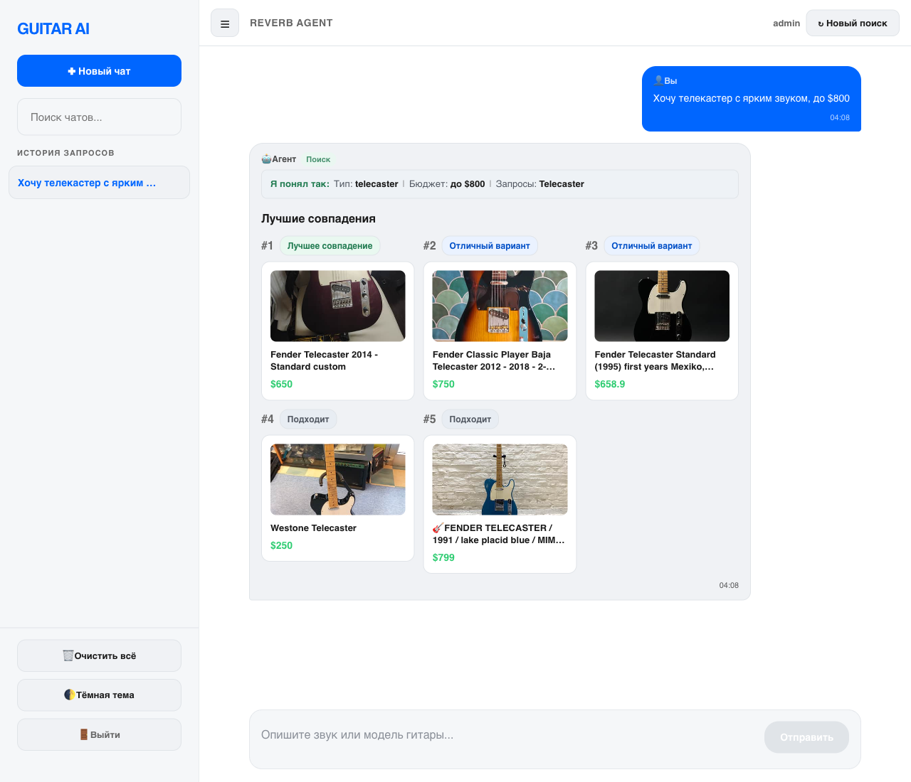
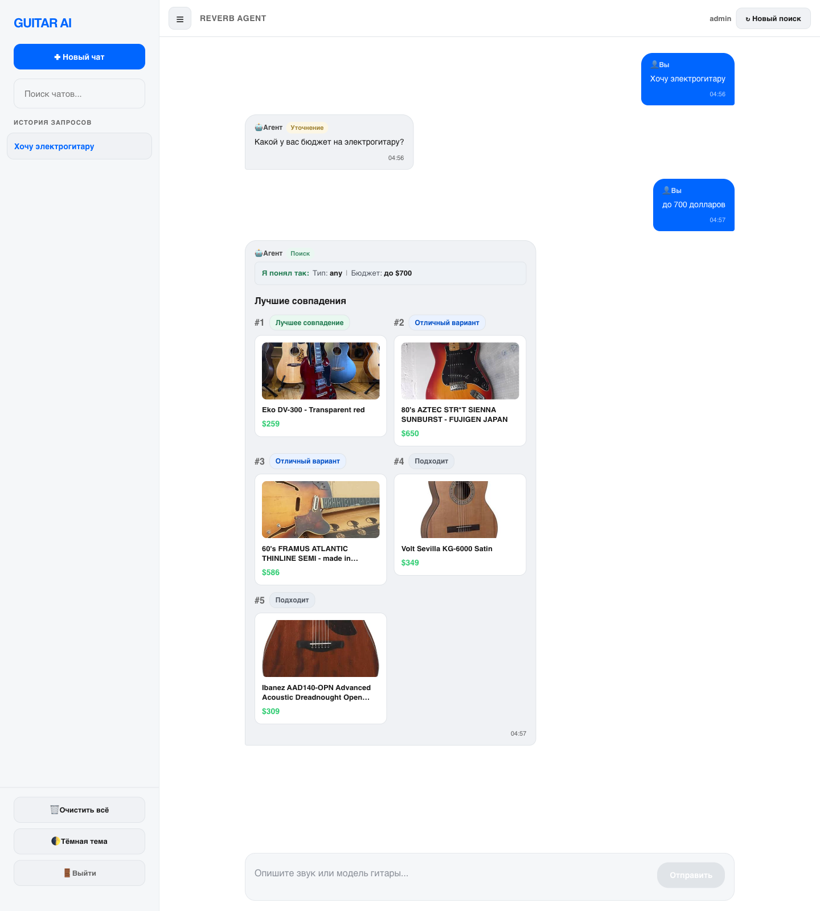

# Черновик тезисов — XVIII Королёвские чтения, секция 8

> **Инструкция при копировании в Word:**
> — Times New Roman 12pt, поля 2 см, отступ 0,75 см, одинарный интервал, выравнивание по ширине.
> — Жирным — ТОЛЬКО название доклада (ПРОПИСНЫМИ). Курсив допустим в зачинах разделов (_Постановка задачи._ и т.п.). Прочих выделений в тексте быть не должно.
> — После инициалов в ФИО ставить **неразрывный пробел** (Ctrl+Shift+Space) — иначе инициалы оторвутся от фамилии при переносе.
> — Проверить, что автозамена Word не превратила «–» (среднее тире) в «-» (дефис) в библиографии и в основном тексте.
> — Markdown-разметка `\*` и `¹` в строке авторов и `\*` перед E-mail — это эскейпы; в Word оставить только `*` (или, лучше, удалить — звёздочка нужна только для связки автор↔E-mail) и поставить надстрочную «1» рядом с фамилиями (стандартный знак сноски на аффилиацию).
> — Математические индексы вида `l_i`, `w_k`, `s_k`, `l_1`, `l_n` в Word привести к нижнему регистру: выделить букву после `_` и нажать Ctrl+= (subscript).
> — Файл назвать: `Фокин_8.doc`

---

УДК 004.89

ИНТЕЛЛЕКТУАЛЬНЫЙ АГЕНТ ПОДБОРА ГИТАР НА ОСНОВЕ ОБРАБОТКИ ЕСТЕСТВЕННОГО ЯЗЫКА И МНОГОКРИТЕРИАЛЬНОГО РАНЖИРОВАНИЯ

Е. А. Фокин¹\*, И. А. Сальников¹, В. О. Павлов¹, Р. Е. Мергалиев¹, А. О. Сидоров¹, Д. И. Хасанов¹
¹Самарский национальный исследовательский университет имени академика С. П. Королева, г. Самара, Российская Федерация

Научный руководитель: А. Н. Жданова, к.т.н., доцент
Самарский национальный исследовательский университет имени академика С. П. Королева, г. Самара, Российская Федерация

\*E-mail: fokinevgeny630@gmail.com

Ключевые слова: рекомендательная система, большая языковая модель, обработка естественного языка, многокритериальное ранжирование, подбор гитар, интеллектуальный агент, семантический разрыв, структурированное извлечение параметров.

Поисковые интерфейсы музыкальных маркетплейсов оперируют техническими параметрами (тип звукоснимателей, порода дерева, бренд), тогда как пользователи, особенно начинающие музыканты, часто описывают желаемый инструмент субъективными эпитетами («тёплый звук», «яркий тембр», «агрессивное звучание»). Это формирует семантический разрыв между намерением пользователя и системой поиска. Под интеллектуальным агентом в рамках работы понимается программная система, способная воспринимать естественно-языковой запрос пользователя, интерпретировать его в структурированную форму, выполнять действия над внешним ресурсом и возвращать пользователю результат в форме, понятной без специальной технической подготовки. В работе предложена комбинированная архитектура, объединяющая языковую модель-маршрутизатор с серверным контуром обработки состояния диалога, и многокритериальная схема ранжирования с экспертно калиброванными весами по семи признакам.

_Актуальность работы определяется_ следующими факторами. Во-первых, быстрый рост объёма онлайн-каталогов музыкальных инструментов и связанная с ним сложность навигации для пользователя без технической подготовки. Во-вторых, сохраняющийся семантический разрыв между естественно-языковым описанием желаемого инструмента («тёплый звук», «для блюза», «гитара начального уровня до восьмидесяти тысяч») и техническими параметрами фильтров маркетплейсов (тип звукоснимателей, длина мензуры, материал грифа). В-третьих, успехи больших языковых моделей в задачах извлечения структурированной информации из текста [1, 2] позволяют автоматизировать семантическую интерпретацию запросов без построения закрытого набора правил.

_Постановка задачи._ Дано: текстовый запрос пользователя q, множество объявлений каталога L = {l_1, …, l_n}, схема допустимых параметров поиска P. Требуется построить структурированный план поиска π(q) ∈ P, определяющий тип инструмента, ценовой диапазон и дополнительные признаки; функцию релевантности R: L × Q → [0, 100], учитывающую множественные критерии соответствия объявления запросу; упорядоченную выборку Top-K объявлений из L, максимизирующую среднюю релевантность R(l, q) при ограничении на длину выдачи K = 5 и на бюджет, заданный в π(q). Целевая функция системы — максимизация средней релевантности возвращаемой выдачи при перечисленных ограничениях. Значение K = 5 выбрано как компромисс между обозримостью результатов для пользователя и охватом разнообразных вариантов выдачи; значение соответствует типичной длине выдачи в рекомендательных системах [3].

_Обзор существующих решений._ Существующие решения частично закрывают эту задачу и принадлежат к двум категориям: широкие маркетплейсы музыкального оборудования (Reverb, Sweetwater) и закрытые системы поэтапного подбора одного производителя (Find Your Fender). Reverb предоставляет поиск и фильтры по каталогу музыкального оборудования [5], Sweetwater развивает подробный каталог с экспертной поддержкой и фильтрами [6], а Find Your Fender предлагает сценарий поэтапного подбора для начинающих игроков [7]. Их преимущество состоит в доступе к готовым каталогам и понятным фильтрам, однако пользователь всё равно должен выбрать технические признаки либо пройти заранее заданный опрос.

| Решение | Что умеет | Категориальное ограничение |
| --- | --- | --- |
| Reverb | Полнотекстовый поиск и фильтрация по крупнейшему международному маркетплейсу музыкального оборудования, ориентированному преимущественно на вторичный рынок | Не использует языковые модели для семантической интерпретации абстрактных запросов; поиск построен на ключевых словах и категориальных фильтрах |
| Sweetwater | Подробные карточки товара розничного магазина, экспертные руководства по подбору, детальная категоризация ассортимента | Работает как каталог магазина: автоматический подбор по абстрактным критериям не предусмотрен |
| Find Your Fender | Сценарий поэтапного подбора с готовыми категориями и сужающимися вопросами | Закрытый сценарий с заранее заданными ветвями; ограничен ассортиментом одного производителя; не поддерживает свободный диалог |
| Предлагаемый агент | Извлекает структурированный план поиска из свободного текста и выполняет многокритериальное ранжирование объявлений | Зависит от качества ответа языковой модели; экспертные веса требуют дальнейшей эмпирической калибровки |

Систематическая постановка задачи интерпретации естественно-языковых запросов и многоходового взаимодействия с пользователем в задачах рекомендации развивается в направлении конверсационных рекомендательных систем [11]. Настоящая работа применяет аналогичный принцип в предметной области каталога электрогитар: пользовательский запрос принимается в свободной форме, недостающие параметры запрашиваются в режиме диалога, итоговая выдача формируется как ранжированный список объявлений.

_Архитектура агента._ Предлагаемое решение использует открытые языковые модели на архитектуре Transformer [1] с разделением ролей маршрутизации и генерации ответов. В прототипе в качестве модели-маршрутизатора и модели-ответчика использована открытая модель openai/gpt-oss-20b, предоставляемая инфраструктурой Groq; архитектурное решение не зависит от конкретной модели и совместимо с моделями семейства Llama [2] и иными открытыми языковыми моделями сопоставимой производительности. На уровне пользовательского взаимодействия агент поддерживает сценарии поиска, консультации и краткого диалогового ответа, а во внутреннем контуре маршрутизации выделяет четыре класса намерений: поиск, консультация, метадиалоговая реплика и нерелевантный запрос. JSON-план включает: тип намерения и признак достаточности данных для поиска; набор полей, требующих уточнения, и набор полей, по которым пользователь явно указал отсутствие предпочтения; итоговый набор поисковых параметров; служебные поля управления состоянием — маркер актуальности готового поиска относительно текущей реплики, режим обновления состояния, признак необходимости предложить расширение бюджета. Такой контракт отделяет вероятностный этап интерпретации естественного языка от детерминированных этапов проверки данных, обращения к источнику объявлений и ранжирования.

В режиме поиска модель извлекает из свободного текста тип инструмента, ценовой диапазон, звукосниматели, бренд и признаки желаемого звучания в заданную структуру параметров. Регулярные выражения принципиально не используются для определения намерения пользователя, языка реплики, метадиалогового подтипа и извлечения семантических ограничений запроса — эти задачи решаются исключительно языковой моделью. Оставшиеся в реализации регулярные выражения локализованы в служебных слоях, не связанных с интерпретацией пользовательского запроса: безопасностный пост-процессинг ответов модели, валидация формата служебных идентификаторов, парсинг кодов ошибок внешнего API.

Предметная таблица маппинга абстрактных звуковых характеристик в технические параметры инструмента (23 описания) сформирована методом ручной онтологизации. В качестве источников использованы: образовательные материалы производителей, описывающие зависимость тембральных характеристик от типа звукоснимателей и конструктивных особенностей инструмента [9, 10]; общепринятые в музыкальной литературе ассоциации между жанровыми категориями и техническими конфигурациями инструмента, отражённые в руководствах по подбору гитар [6]. Так, одиночные звукосниматели связываются с ярким и чистым звучанием, хамбакеры — с более плотным и тёплым звуком; для классических джазовых конфигураций характерно использование полуакустических корпусов с хамбакером у грифа, для высокоусиленных стилей — конфигурации с двумя хамбакерами высокого выхода. Полученная таблица используется как формализованное знание предметной области в составе системного промпта языковой модели и в правилах ранжирования. Эмпирическая верификация таблицы на пользовательском датасете отнесена к направлениям развития. В режиме консультации отдельный промпт языковой модели генерирует экспертный ответ на теоретические вопросы, а метадиалоговые реплики обрабатываются без изменения сохранённого поискового контекста и без обращения к каталогу.

Рис. 1. Схема интеллектуального контура агента.

Серверный контур обеспечивает устойчивость работы системы к недетерминированности языковой модели за счёт следующих механизмов. Первый механизм — структурная валидация JSON-плана с возвратом ошибки и повторным запросом к модели при нарушении контракта. Второй — согласование частичного вывода модели с накопленным контекстом диалога: если в текущем ходе значение параметра поиска не возвращено моделью, серверный контур сохраняет ранее подтверждённое значение из состояния сессии. Третий — защитные правила повторного уточнения: при повторном запросе моделью одних и тех же полей при достаточности накопленных параметров серверный контур инициирует выполнение поиска без передачи управления модели. Четвёртый — детерминированные пользовательские действия: при отсутствии результатов в исходных параметрах серверный контур вычисляет минимальную доступную цену в подвыборке каталога и формирует структурированное предложение по расширению бюджета. Пятый — сохранение состояния диалога (история сообщений, накопленные параметры поиска) в локальной реляционной базе данных, что обеспечивает воспроизводимость многоходовых сценариев. Взаимодействие пользователя с агентом реализовано в форме веб-чата, поддерживающего многоходовой диалог, отображение результатов поиска карточками объявлений и детерминированные действия в форме кнопок. При нарушении контракта сервер инициирует повторное формирование плана; при повторной неудаче применяется одна из серверных резервных стратегий (использование накопленных параметров диалога, ответ из режима консультации, предложение расширения бюджета); если ни одна стратегия не применима, возвращается явная ошибка обработки. Такое разделение отделяет вероятностный этап интерпретации естественного языка от детерминированных этапов управления диалогом и доступа к каталогу, обеспечивая предсказуемое поведение системы при сбоях языковой модели. Архитектура минимизирует число обращений к языковой модели на ход диалога: для типового сценария поиска выполняется один вызов модели-маршрутизатора; обращения к модели-ответчику опциональны и применяются только в режимах консультации и формирования объяснения результата.

_Алгоритм ранжирования._ Для ранжирования найденных объявлений разработан алгоритм взвешенной многокритериальной оценки, основанный на аддитивной свёртке критериев, применяемой в задачах рекомендательных систем и многокритериального принятия решений [3, 4]. Итоговый балл результата вычисляется по формуле:

`R(l_i, q) = Σ w_k · s_k(l_i, q)`,

где i — индекс объявления, k — индекс критерия (k = 1..7), w_k ∈ [0, 1] — вес критерия (Σ w_k = 1), s_k(l_i, q) ∈ [0, 100] — частная оценка по критерию k, R(l_i, q) ∈ [0, 100] — итоговая релевантность. В расширенной модели используются семь критериев: соответствие бюджету, тип инструмента, конфигурация звукоснимателей, характер звучания, бренд, музыкальный стиль и релевантность заголовка.

Веса критериев определены на основе сложившейся в специализированных руководствах по подбору гитар и образовательных материалах производителей [6, 9, 10] иерархии важности характеристик: бюджет — как первичное ограничение пользовательского выбора; тип инструмента и конфигурация звукоснимателей — как ключевые технические параметры, непосредственно влияющие на применимость и звук; характер звучания, бренд, музыкальный стиль и релевантность заголовка — как уточняющие признаки. Численные значения весов получены путём калибровки по этой иерархии: бюджет — 0,25, тип инструмента — 0,20, конфигурация звукоснимателей — 0,15, характер звучания — 0,12, бренд — 0,10, музыкальный стиль — 0,10, релевантность заголовка — 0,08. Сумма весов нормирована к 1,00. Каждый критерий оценивается по шкале от 0 до 100 баллов с промежуточными градациями. При отсутствии дополнительных параметров инструмента используется упрощённая форма оценки по двум критериям — бюджету и релевантности заголовка с весами 0,55 и 0,45. Эмпирическая калибровка весов на размеченной пользовательской выборке отнесена к направлениям развития работы.

Рис. 2. Схема многокритериальной оценки релевантности. Объявление оценивается параллельно по семи критериям, каждая частная оценка s_k ∈ [0, 100] взвешивается коэффициентом w_k и суммируется; итоговое значение R(l_i, q) определяет порядок ранжирования в выдаче Top-K.

_Результаты._ Разработан рабочий прототип системы [8]. В проекте сформирована предметная таблица из 23 абстрактных описаний звучания и жанровых признаков, используемая при проектировании схемы поисковых параметров и правил ранжирования; серверный контур валидирует полученный план, сохраняет подтверждённый набор параметров как контекст диалога и возвращает ранжированные результаты. Для воспроизводимой демонстрации поддерживается режим работы с локальным набором данных, имитирующим ответы каталога Reverb. Это позволяет воспроизводить и тестировать пайплайн без внешней зависимости от состояния маркетплейса и сетевой доступности.

Корректность работы прототипа подтверждена набором acceptance-сценариев. Маршрутизация запроса проверена на сценариях, охватывающих четыре класса намерений (поиск, консультация, метадиалоговая реплика, нерелевантный запрос) и переходы между ними в многоходовом диалоге. Ранжирование проверено на десяти сценариях [8], каждый из которых задаёт текстовый запрос, набор объявлений и ожидаемый результат; во всех сценариях ожидаемый результат попадает в Top-5 выдачи. Acceptance-проверка подтверждает корректность поведения прототипа на типовых сценариях разработки, но не является статистической оценкой качества системы. Для последней требуется размеченная пользовательская выборка с независимыми оценками релевантности; её сбор и применение метрик MRR и nDCG@K, принятых в задачах информационного поиска и рекомендательных систем [3], отнесены к направлениям развития.

Рис. 3. Пример поисковой выдачи прототипа: естественно-языковой запрос пользователя, ранжированный список объявлений с ценой и ссылкой на источник.

Рис. 4. Пример многоходового диалога: на первый неполный запрос пользователя агент задаёт уточняющий вопрос о ценовом диапазоне; после ответа пользователя сервер выполняет поиск и возвращает ранжированную выдачу.

_Ограничения и направления развития._ К ограничениям текущей версии относятся: поддержка единственного маркетплейса (Reverb); ограниченный набор нормализуемых признаков инструмента и звучания; зависимость качества маршрутизации и извлечения параметров от возможностей используемой языковой модели; необходимость строгой валидации структурированных ответов языковой модели; экспертный характер весов ранжирования и предметного маппинга, требующий дальнейшей эмпирической калибровки на большем наборе пользовательских запросов; зависимость качества обработки русскоязычных запросов от мультиязычных возможностей выбранной языковой модели — отдельный механизм перевода и нормализации языка в текущей версии не предусмотрен; отсутствие механизма персонализации на основе истории предпочтений пользователя. Перспективные направления развития включают расширение на другие торговые площадки, увеличение предметной базы маппингов, введение количественных метрик качества маршрутизации и ранжирования (MRR, nDCG@K) на репрезентативной пользовательской выборке и внедрение пользовательских профилей.

Библиографический список

1. Vaswani, A. Attention Is All You Need / A. Vaswani, N. Shazeer, N. Parmar [и др.] // Advances in Neural Information Processing Systems. – 2017. – Vol. 30. – P. 5998–6008.
2. Grattafiori, A. The Llama 3 Herd of Models : препринт / A. Grattafiori, A. Dubey, A. Jauhri [и др.]. – arXiv:2407.21783. – 2024. – 92 p.
3. Recommender Systems Handbook / ed. by F. Ricci, L. Rokach, B. Shapira. – 2nd ed. – New York : Springer, 2015. – 1003 p.
4. Triantaphyllou, E. Multi-criteria Decision Making Methods: A Comparative Study / E. Triantaphyllou. – New York : Springer, 2000. – 290 p.
5. Reverb / Reverb LLC. – URL: https://reverb.com/ (дата обращения: 25.05.2026).
6. Electric Guitars / Sweetwater. – URL: https://www.sweetwater.com/shop/guitars/electric-guitars/ (дата обращения: 25.05.2026).
7. Find Your Fender FAQs / Fender. – URL: https://support.fender.com/hc/en-us/articles/42509429292699-Find-Your-Fender-FAQs (дата обращения: 25.05.2026).
8. Фокин, Е. А. Guitar Agent Turbo: репозиторий проекта / Е. А. Фокин, И. А. Сальников, В. О. Павлов [и др.]. – 2026. – URL: https://github.com/algorithm-ssau/2026-6303-2-guitar-AGENT_TURBO (дата обращения: 25.05.2026).
9. Single-coil or humbucker: how to choose the right pickup / Fender. – URL: https://www.fender.com/articles/instruments/electric-guitar-pickup-types-how-to-choose-your-pickup (дата обращения: 25.05.2026).
10. Electric guitar: types of pickups / Yamaha. – URL: https://usa.yamaha.com/products/contents/guitars_basses/difference/electric_guitar.html (дата обращения: 25.05.2026).
11. Jannach, D. A Survey on Conversational Recommender Systems / D. Jannach, A. Manzoor, W. Cai, L. Chen // ACM Computing Surveys. – 2021. – Vol. 54, No. 5. – Article 105. – 36 p. – DOI: 10.1145/3453154.
