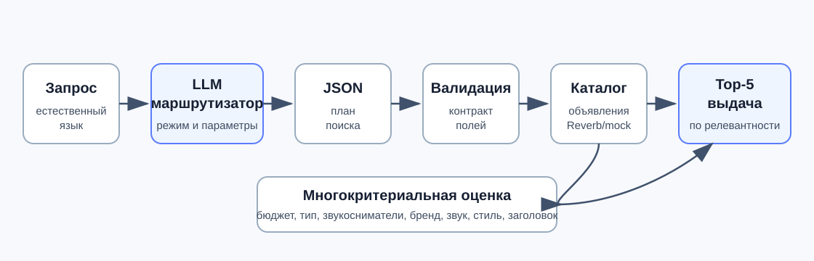
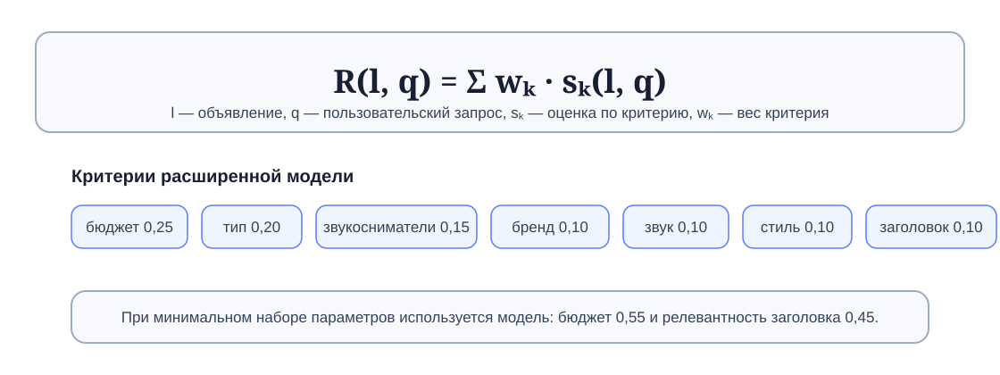

# Черновик тезисов — XVIII Королёвские чтения, секция 8

> **Инструкция при копировании в Word:**
> — Times New Roman 12pt, поля 2 см, отступ 0,75 см, одинарный интервал, выравнивание по ширине.
> — Жирным — ТОЛЬКО название доклада (ПРОПИСНЫМИ). В тексте никаких жирных слов, цитат, выделений быть не должно.
> — После инициалов в ФИО ставить **неразрывный пробел** (Ctrl+Shift+Space) — иначе инициалы оторвутся от фамилии при переносе.
> — Проверить, что автозамена Word не превратила «–» (среднее тире) в «-» (дефис) в библиографии и в основном тексте.
> — Markdown-разметка `\*` и `¹` в строке авторов и `\*` перед E-mail — это эскейпы; в Word оставить только `*` (или, лучше, удалить — звёздочка нужна только для связки автор↔E-mail) и поставить надстрочную «1» рядом с фамилиями (стандартный знак сноски на аффилиацию).
> — Файл назвать: `Фокин_8.doc`

---

УДК 004.89

ИНТЕЛЛЕКТУАЛЬНЫЙ АГЕНТ ПОДБОРА ГИТАР НА ОСНОВЕ ОБРАБОТКИ ЕСТЕСТВЕННОГО ЯЗЫКА И МНОГОКРИТЕРИАЛЬНОГО РАНЖИРОВАНИЯ

Е. А. Фокин¹\*, И. А. Сальников¹, В. О. Павлов¹, Р. Е. Мергалиев¹, А. О. Сидоров¹, Д. И. Хасанов¹
¹Самарский национальный исследовательский университет имени академика С. П. Королева, г. Самара, Российская Федерация

Научный руководитель: А. Н. Жданова, к.т.н., доцент
Самарский национальный исследовательский университет имени академика С. П. Королева, г. Самара, Российская Федерация

\*E-mail: fokinevgeny630@gmail.com

Ключевые слова: рекомендательная система, большая языковая модель, обработка естественного языка, многокритериальное ранжирование, подбор гитар

Поисковые интерфейсы музыкальных маркетплейсов оперируют техническими параметрами (тип звукоснимателей, порода дерева, бренд), тогда как пользователи, особенно начинающие музыканты, часто описывают желаемый инструмент субъективными эпитетами («тёплый звук», «яркий тембр», «агрессивное звучание»). Это формирует семантический разрыв между намерением пользователя и системой поиска. Актуальность задачи связана с ростом объёма онлайн-каталогов музыкальных инструментов и необходимостью снижать порог входа для пользователей, которые не владеют технической терминологией. В отличие от стандартных фильтров маркетплейсов, требующих явного задания характеристик, интеллектуальный агент принимает естественно-языковое описание и преобразует его в структурированный поисковый план.

Задача работы формулируется следующим образом. На вход подаются текстовый запрос пользователя `q` и множество объявлений `L = {l1, ..., ln}` из каталога. Требуется построить структурированные параметры поиска `p(q)`, вычислить оценку релевантности `R(li, q)` для найденных объявлений и вернуть пользователю упорядоченный список `Top-5`, максимизирующий соответствие исходному запросу. Выходными данными системы являются карточки объявлений с названием, ценой и ссылкой, отсортированные по убыванию рассчитанной релевантности.

Существующие решения частично закрывают эту задачу. Reverb предоставляет поиск и фильтры по каталогу музыкального оборудования [5], Sweetwater развивает подробный каталог с экспертной поддержкой и фильтрами [6], а Find Your Fender предлагает сценарий guided recommendation для начинающих игроков [7]. Их преимущество состоит в доступе к готовым каталогам и понятным фильтрам, однако пользователь всё равно должен выбрать технические признаки либо пройти заранее заданный опрос. Предлагаемый агент отличается тем, что преобразует свободное описание потребности в структурированный план поиска и далее ранжирует найденные объявления по нескольким критериям.

| Решение | Что умеет | Ограничение |
| --- | --- | --- |
| Reverb | Поиск по каталогу и фильтрация объявлений | Требует знания модели, бренда или фильтров |
| Sweetwater | Подробные карточки, категории, экспертная поддержка | Работает как каталог магазина, а не как интерпретатор свободного запроса |
| Find Your Fender | Опрос для начинающих и персональные рекомендации | Ограничен guided-форматом и каталогом бренда |
| Предлагаемый агент | Извлекает параметры из естественного языка и ранжирует объявления | Требует валидации LLM-вывода и калибровки весов |

Предлагаемое решение использует большие языковые модели семейства Llama [2], построенные на архитектуре Transformer [1], с разделением ролей маршрутизации и генерации ответов. В прототипе LLM-маршрутизатор формирует структурированный JSON-план обработки запроса, а отдельный генеративный контур используется для консультаций и пояснений к результатам. На уровне пользовательского взаимодействия агент поддерживает сценарии поиска и консультации, а во внутреннем контуре маршрутизации выделяет три класса намерений: поиск, консультация и нерелевантный запрос. JSON-план включает тип намерения, признак достаточности данных для поиска, список недостающих полей и итоговый набор поисковых параметров. Для готового поиска этот набор является полным набором параметров текущего запроса: он содержит поисковые строки, ценовой диапазон или бюджет, тип инструмента либо значение «any», а также дополнительные признаки при их наличии. Такой контракт отделяет вероятностный этап интерпретации естественного языка от детерминированных этапов проверки данных, обращения к источнику объявлений и ранжирования. В режиме поиска модель извлекает из свободного текста тип инструмента, ценовой диапазон, звукосниматели, бренд и признаки желаемого звучания в заданную структуру параметров. Регулярные выражения не используются для определения намерения или извлечения семантических ограничений; сервер выполняет только структурную валидацию JSON-контракта и допустимых значений полей. Предметная таблица маппинга абстрактных звуковых характеристик сформирована как инженерная онтология предметной области на основе распространённых описаний звукоснимателей и тембра в справочных материалах производителей [9, 10]. Например, одиночные звукосниматели связываются с ярким и чистым звучанием, а хамбакеры — с более плотным и тёплым звуком; эти связи фиксируются в таблице признаков и затем используются при проектировании схемы параметров и правил ранжирования. В режиме консультации отдельный промпт LLM генерирует экспертный ответ на теоретические вопросы.

Рис. 1. Схема интеллектуального контура агента.

Для ранжирования найденных объявлений разработан алгоритм взвешенной многокритериальной оценки, основанный на аддитивной свёртке критериев, применяемой в задачах рекомендательных систем и многокритериального принятия решений [3, 4]. Итоговый балл результата вычисляется по формуле:

`R(li, q) = Σ wk * sk(li, q)`,

где `sk` — частная оценка объявления по критерию, а `wk` — вес критерия. В расширенной модели используются семь критериев: соответствие бюджету (0,25), тип инструмента (0,20), конфигурация звукоснимателей (0,15), бренд (0,10), характер звучания (0,10), музыкальный стиль (0,10) и релевантность заголовка (0,10). Веса заданы как предварительная экспертная калибровка в рамках аддитивной модели MCDA [3, 4]. Процедура выбора весов основана на разделении признаков на жёсткие ограничения и уточняющие предпочтения: бюджет и тип инструмента получают суммарно 0,45 как параметры, непосредственно ограничивающие допустимый набор объявлений; конфигурация звукоснимателей получает 0,15 как основной технический индикатор звучания; бренд, стиль, характер звучания и заголовок получают по 0,10 как мягкие признаки релевантности. Сумма весов нормирована к 1,00. Каждый критерий оценивается по шкале от 0 до 100 баллов с промежуточными градациями. При отсутствии дополнительных параметров инструмента используется упрощённая форма оценки по двум критериям — бюджету и релевантности заголовка с весами 0,55 и 0,45.

Рис. 2. Схема взвешенной многокритериальной оценки.

Система реализована как прототип интеллектуального агента, в котором основная обработка сосредоточена в контуре маршрутизации, валидации и ранжирования. Для снижения недетерминированности LLM серверная часть проверяет JSON-контракт, допустимые значения полей и согласованность готового набора поисковых параметров. Если ответ модели нарушает контракт, сервер запрашивает повторное формирование структурированного плана; при повторной ошибке возвращается явная ошибка обработки. Сервер не дополняет параметры поиска эвристическими правилами и не восстанавливает текущий поиск из устаревшего состояния сессии: готовый поиск выполняется по параметрам, явно возвращённым LLM-маршрутизатором.

Разработан рабочий прототип системы [8]. Его проверка проводилась на контрольных сценариях с заранее заданными ожидаемыми режимами ответа и параметрами поиска: поиск по бюджету, модели и характеру звучания, консультационные вопросы, уточняющие реплики и нерелевантные запросы. В проекте сформирована предметная таблица из 23 абстрактных описаний звучания и жанровых признаков, используемая при проектировании схемы поисковых параметров и правил ранжирования; серверная часть валидирует полученный план, сохраняет подтверждённый набор параметров как контекст диалога и возвращает ранжированные результаты. Для воспроизводимой демонстрации поддерживается режим работы с локальным набором данных, сохраняющий полный конвейер фильтрации и ранжирования. Для оценки использованы две группы метрик: качество маршрутизации оценивается по accuracy и macro-F1, а качество ранжирования — по Hit@5, MRR и nDCG@5, принятым в задачах информационного поиска и рекомендательных систем [3].

| Оцениваемый контур | Размер контрольной выборки | Метрики | Значение |
| --- | ---: | --- | --- |
| Маршрутизация запроса | 4 сценария | accuracy, macro-F1 | 1,00; 1,00 |
| Ранжирование Top-5 | 9 сценариев | Hit@1, Hit@5, MRR, nDCG@5 | 1,00; 1,00; 1,00; 1,00 |

Полученные значения характеризуют acceptance-проверку алгоритма на типовых сценариях прототипа, а не полноту оценки на реальном пользовательском распределении.

Рис. 3. Иллюстративный пример результата агента в пользовательском интерфейсе.

К ограничениям текущей версии относятся: поддержка единственного маркетплейса (Reverb); ограниченный набор нормализуемых признаков инструмента и звучания; зависимость качества маршрутизации и извлечения параметров от возможностей используемой языковой модели; необходимость строгой валидации структурированных ответов LLM; экспертный характер весов ранжирования и предметного маппинга, требующий дальнейшей эмпирической калибровки на большем наборе пользовательских запросов; отсутствие механизма персонализации на основе истории предпочтений пользователя. Перспективные направления развития включают расширение на другие торговые площадки, увеличение предметной базы маппингов, введение количественных метрик качества маршрутизации на репрезентативной выборке и внедрение пользовательских профилей.

Библиографический список

1. Vaswani, A. Attention Is All You Need / A. Vaswani, N. Shazeer, N. Parmar [и др.] // Advances in Neural Information Processing Systems. – 2017. – Vol. 30. – P. 5998–6008.
2. Grattafiori, A. The Llama 3 Herd of Models : препринт / A. Grattafiori, A. Dubey, A. Jauhri [и др.]. – arXiv:2407.21783. – 2024. – 92 p.
3. Recommender Systems Handbook / ed. by F. Ricci, L. Rokach, B. Shapira. – 2nd ed. – New York : Springer, 2015. – 1003 p.
4. Triantaphyllou, E. Multi-criteria Decision Making Methods: A Comparative Study / E. Triantaphyllou. – New York : Springer, 2000. – 290 p.
5. Searching for gear? / Reverb Help Center. – URL: https://help.reverb.com/hc/en-us/articles/41988881129243-Searching-for-gear (дата обращения: 12.05.2026).
6. Electric Guitars / Sweetwater. – URL: https://www.sweetwater.com/shop/guitars/electric-guitars/ (дата обращения: 12.05.2026).
7. Find Your Fender FAQs / Fender. – URL: https://support.fender.com/hc/en-us/articles/42509429292699-Find-Your-Fender-FAQs (дата обращения: 12.05.2026).
8. Фокин, Е. А. Guitar Agent Turbo: репозиторий проекта / Е. А. Фокин, И. А. Сальников, В. О. Павлов [и др.]. – 2026. – URL: https://github.com/algorithm-ssau/2026-6303-2-guitar-AGENT_TURBO (дата обращения: 12.05.2026).
9. Single-coil or humbucker: how to choose the right pickup / Fender. – URL: https://www.fender.com/articles/instruments/electric-guitar-pickup-types-how-to-choose-your-pickup (дата обращения: 12.05.2026).
10. Electric guitar: types of pickups / Yamaha. – URL: https://usa.yamaha.com/products/contents/guitars_basses/difference/electric_guitar.html (дата обращения: 12.05.2026).
